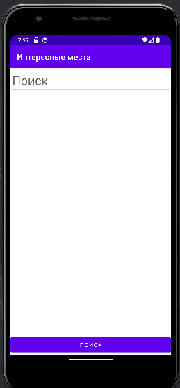
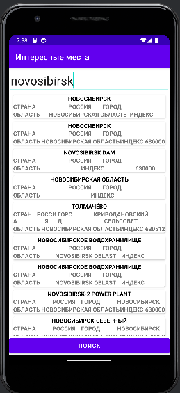

# InterestingPlacesApp

<div id="header" align="center">
  
</div>

## Описание

Android приложения для поиска информации об интересных местах возле населенных пунктов.

## Стек

```Android SDK, RxJava, Retrofit2```

## Фичи-лист

- [просмотр локаций с координатами и названиями](https://docs.graphhopper.com/#operation/getGeocode)
- [просмотр погоды]( https://openweathermap.org/current)
- [получение списка интересных мест рядом с локациями](https://opentripmap.io/docs#/Objects%20list/getListOfPlacesByRadius)
- [получение описания места](https://opentripmap.io/docs#/Object%20properties/getPlaceByXid)
- просмотр фотографий мест
- ссылка на wiki места

## Интерфейс




